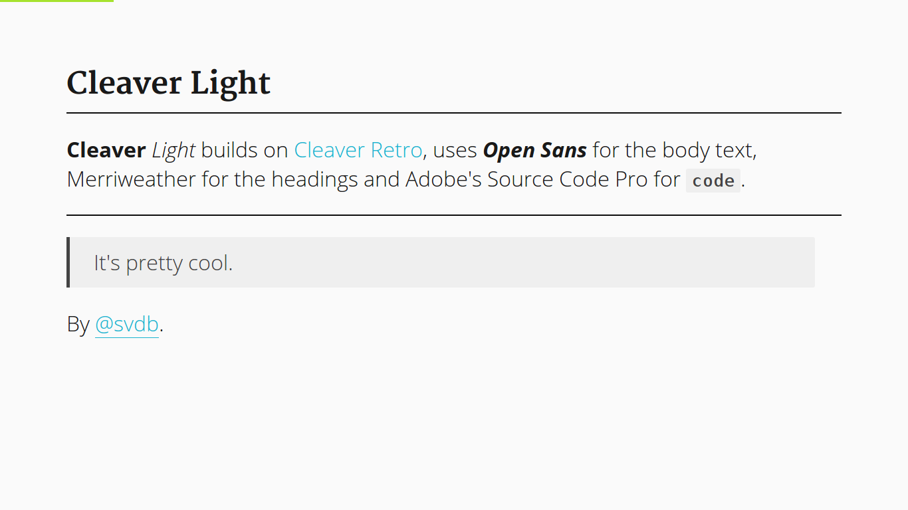

# Cleaver Light

*Preview at http://svdb.co/cleaver-light/*

**Cleaver** *Light* builds on [Cleaver Retro](http://github.com/jdan/cleaver-retro), uses ***Open Sans*** for the body text, Merriweather for the headings and Adobe's Source Code Pro for `code`.

&mdash; [@svdb](https://www.twitter.com/svdb)

# Usage

The easiest way to use Cleaver Light is to use the following YAML in your Markdown file: `theme: sjaakvandenberg/cleaver-light`.

You can also fork or clone it to create your own version of it.

    $ git clone git@github.com:sjaakvandenberg/cleaver-light.git

## File Structure

    . cleaver-light
    ├── cleaver-light.png
    ├── layout.mustache
    ├── README.md
    ├── script.js
    ├── settings.json
    ├── style.css
    └── template.mustache

## Credits

* [Cleaver](https://github.com/jdan/cleaver) and [Cleaver Retro](http://github.com/jdan/cleaver-retro) by [Jordan Scales](https://github.com/jdan)
* [Open Sans](https://www.google.com/fonts/specimen/Open+Sans) by [Steve Matteson](https://en.wikipedia.org/wiki/Steve_Matteson)
* [Merriweather](https://www.google.com/fonts/specimen/Merriweather) by [Eben Sorkin](http://sorkintype.com/)
* [Source Code Pro](https://github.com/adobe-fonts/source-code-pro) by [Paul Hunt](https://www.adobe.com/products/type/font-designers/paul-hunt.html)
* [Cleaver Light](https://github.com/sjaakvandenberg/cleaver-light) by [@svdb](https://www.twitter.com/svdb)

## License

Cleaver Light

The MIT License (MIT)

Copyright (c) 2015 Sjaak van den Berg <mail@svdb.co>

Permission is hereby granted, free of charge, to any person obtaining a
copy of this software and associated documentation files (the "Software"),
to deal in the Software without restriction, including without limitation
the rights to use, copy, modify, merge, publish, distribute, sublicense,
and/or sell copies of the Software, and to permit persons to whom the
Software is furnished to do so, subject to the following conditions:

The above copyright notice and this permission notice shall be included in
all copies or substantial portions of the Software.

THE SOFTWARE IS PROVIDED "AS IS", WITHOUT WARRANTY OF ANY KIND, EXPRESS OR
IMPLIED, INCLUDING BUT NOT LIMITED TO THE WARRANTIES OF MERCHANTABILITY,
FITNESS FOR A PARTICULAR PURPOSE AND NONINFRINGEMENT. IN NO EVENT SHALL
THE AUTHORS OR COPYRIGHT HOLDERS BE LIABLE FOR ANY CLAIM, DAMAGES OR OTHER
LIABILITY, WHETHER IN AN ACTION OF CONTRACT, TORT OR OTHERWISE, ARISING
FROM, OUT OF OR IN CONNECTION WITH THE SOFTWARE OR THE USE OR OTHER
DEALINGS IN THE SOFTWARE.
